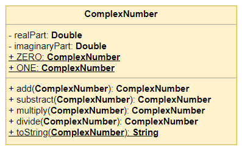

# Komplex számok

Ebben a feladatban a matematikai komplex számokra alkotunk modellt és implementáljuk néhány alapvető műveletüket.

## Mi az a komplex szám?

A komplex számok a valós számokkal ellentétben két komponensből épülnek fel: valós és imaginárius. Mind a két értéket egy valós számmal tudjuk megadni, például lehet $5$ a valós és $3$ az imaginárius komponens. Ezek együtt alkothatnak egy komplex számot, melyet $5 + 3i$ alakban adunk meg, melyben az $i$ az imaginárius egységet jelöli.

> A valós számok halmazán gyakran belefuthatunk olyan megoldhatatlan egyenletekbe, amikben egy $\sqrt{-1}$ típusú értékkel kellene számolnunk, például másodfokú megoldóképlet alkalmazásakor, vagy úgy általában polinomok gyökének megállapításakor ($x^n \cdot a_n + x^{n-1} \cdot a_{n-1} \ ... \ x^2 \cdot a_2 + x \cdot a = 0$ típusú egyenletek). Mivel a valós számokon a negatív értékből való gyökvonás nem értelmezett, ezért a matematikusok kibővítették a valós számokat egy imaginárius egységgel, azaz az $i$-vel, mely definíció szerint $i^2 = -1$ és az ezzel megalkotott számhalmazt elnevezték komplex számhalmaznak ($\C$).

A komplex számhalmazon végezhető műveletek kicsit másképp néznek ki, mint a valós számokon.

- Összeadásnál a komponenseket külön összeadjuk.
	$\boxed{1 + 3i} + \boxed{2 + 5i} = 3 + 8i$ 
- Kivonásnál a komponenseket külön kivonjuk egymásból.
	$\boxed{1 + 3i} - \boxed{2 + 5i} = -1 - 2i$ 
- Szorzás nem ennyire egyszerű, mivel egy kicsit bonyolultabb képletet kell alkalmaznunk.
	$\boxed{x_1 + y_1i} \cdot \boxed{x_2 + y_2i} = (x_1\cdot x_2 + y_1 \cdot y_2) + (x_1 \cdot y_2 + x_2 \cdot y_1)i$ 
- Osztásnál még egy, még ennél is bonyolultabb képletet kell alkalmazni.
	$\frac{\Large x_1 + y_1i}{\Large x_2 + y_2i} = \frac{\Large x_1 \cdot y_1 + x_2 \cdot y_2}{\Large x_2^2 + y_2^2} + \frac{\Large y_1 \cdot x_2 - x_1 \cdot y_2}{\Large x_2^2 + y_2^2} \cdot i$

## Feladat leírása

Készítsük el a `ComplexNumber` osztályt, melynek példányai egy-egy komplex számot reprezentálhatnak.

- Az osztálynak legyen két mezője, melyben a valós (`realPart`) és imaginárius (`imaginaryPart`) komponensek értékét tároljuk `double` értékként.
- Az példányszintű mezőkre hozzunk létre *getter* és *setter* metódusokat, magukat a mezőket pedig tegyük az osztályon kívülről hozzáférhetetlenné.
- Hozzuk létre a négy alapvető műveletre a példányszintű metódusokat, melyek mindegyike fogad egy másik `ComplexNumber` példányt. A metódus eredménye legyen egy új, az adott művelet eredményét reprezentáló `ComplexNumber` példány.
- Hozzuk létre a `ComplexNumberTest` _JUnit 5_ teszt osztályt, melyben a műveletekre adunk meg teszteket.
- Hozzuk létre a `ComplexNumber.toString()` osztályszintű metódust, mely fogad paraméterként egy komplex számot és előállítja hozzá a szám `String` reprezentációját, azaz a $x + yi$ alakot.
	- Ha egy komponens értéke egész szám, de a `double` típus miatt feleslegesen megjelenne egy $0$ tizedes jegy, akkor oldjuk meg, hogy az ne jelenjen meg a `String`-ben.
	- Ha az imaginárius komponens negatív értékű, akkor a $x - yi$ mintát kövesse a metódus eredménye.
- Hozzunk létre két konstanst a `ComplexNumber` osztályban, melyek a $0 + 0i$ (`ZERO`), illetve az $1 + 0i$ (`ONE`) értékeknek felelnek meg.
- Bővítsük ki a teszt osztályunkat a következők szerint:
	- A `toString` műveletet ellenőrizzük le pozitív és negatív imaginárius komponensre.
	- A két konstansra hozzunk létre egy-egy teszt metódust, melyben megvizsgáljuk, hogy a `ZERO`-val való összeadás, illetve a `ONE`-nal való szorzás idempotens, azaz a művelet eredménye az eredeti operandus.

